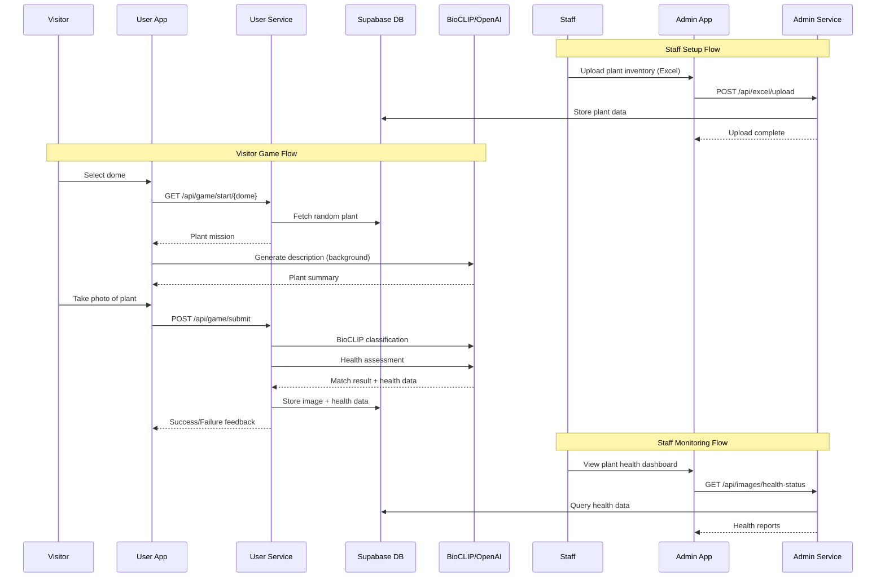

# Milwaukee Domes Interactive Plant Discovery

An interactive mobile-first web application for visitors to the Milwaukee Domes conservatory, enabling plant discovery through AI-powered image recognition while breaking language barriers and collecting valuable plant health data for staff.

## 🌿 Project Overview

This project transforms the visitor experience at the Milwaukee Domes by creating an engaging, educational scavenger hunt-style game. Visitors can:

- **Discover Plants**: Find and photograph plants throughout the three domes (Desert, Tropical, Show)
- **Break Language Barriers**: Access plant information in multiple languages (English, Spanish, Chinese)
- **Learn Interactively**: Get AI-generated plant descriptions and fun facts
- **Contribute Data**: Help staff monitor plant health through crowd-sourced photography

Meanwhile, staff benefit from:
- **Plant Health Monitoring**: AI-powered health assessments from visitor photos
- **Data Collection**: Automated image storage and analysis
- **Collection Management**: Easy Excel-based plant inventory uploads

## 🏗️ Architecture

The project consists of four main components:

```
┌─────────────────────────────────────────────────────────────────┐
│                         USERS & STAFF                            │
└────────────┬──────────────────────────────────┬─────────────────┘
             │                                  │
             ▼                                  ▼
    ┌────────────────┐                 ┌────────────────┐
    │   User App     │                 │   Admin App    │
    │   (React)      │                 │   (React)      │
    │                │                 │                │
    │ • Photo Capture│                 │ • Excel Upload │
    │ • Plant Info   │                 │ • Image Review │
    │ • Multi-lang   │                 │ • Health Data  │
    └────────┬───────┘                 └────────┬───────┘
             │                                  │
             │ HTTP/REST                        │ HTTP/REST
             │                                  │
             ▼                                  ▼
    ┌────────────────┐                 ┌────────────────┐
    │ User Service   │                 │ Admin Service  │
    │ (FastAPI)      │                 │ (FastAPI)      │
    │                │                 │                │
    │ • BioCLIP AI   │                 │ • Excel Parser │
    │ • Health Check │                 │ • Data Import  │
    │ • Image Match  │                 │ • Image Mgmt   │
    └────────┬───────┘                 └────────┬───────┘
             │                                  │
             └──────────────┬───────────────────┘
                            │
                            ▼
                   ┌────────────────┐
                   │   Supabase     │
                   │                │
                   │ • PostgreSQL   │
                   │ • Storage      │
                   │ • Auth (future)│
                   └────────────────┘
```

### System Flow



## 🛠️ Tech Stack

### Frontend Applications

#### User App (`user-app/`)
**Purpose**: Mobile-first visitor interface for plant discovery game

**Technologies**:
- **React 19** - UI framework
- **TypeScript** - Type safety
- **Vite** - Build tool and dev server
- **TailwindCSS 4** - Styling
- **Radix UI** - Accessible components
- **Axios** - API communication
- **Vitest** - Testing framework

**Key Features**:
- Camera integration for plant photography
- Multi-language support (i18n)
- Responsive mobile-first design
- Real-time AI feedback
- Progressive loading states

#### Admin App (`admin-app/`)
**Purpose**: Staff dashboard for plant management and health monitoring

**Technologies**:
- **React 19** - UI framework
- **TypeScript** - Type safety
- **Vite** - Build tool
- **TailwindCSS 4** - Styling
- **React Router** - Navigation
- **Radix UI** - Accessible components

**Key Features**:
- Excel file upload and parsing
- Plant inventory management
- Health status dashboard
- Image gallery and review

### Backend Services

#### User Service (`user-service/`)
**Purpose**: Game logic, AI classification, and health assessment

**Technologies**:
- **FastAPI** - Python web framework
- **BioCLIP** - Plant image classification AI
- **OpenAI GPT-4** - Plant descriptions and health analysis
- **Tavily API** - Web search for plant information
- **Supabase Client** - Database and storage
- **Pillow** - Image processing

**Key Features**:
- Plant identification using BioCLIP model
- AI-powered plant health assessment
- Image verification and matching
- Multi-language plant summaries
- Automated data collection

#### Admin Service (`admin-service/`)
**Purpose**: Plant data management and Excel processing

**Technologies**:
- **FastAPI** - Python web framework
- **Pandas** - Excel data processing
- **OpenPyXL** - Excel file parsing
- **Supabase Client** - Database operations

**Key Features**:
- Excel file upload and validation
- Bulk plant data import
- Plant inventory queries
- Image management endpoints

### Database & Storage

#### Supabase
**Purpose**: Backend-as-a-Service for data and file storage

**Components**:
- **PostgreSQL** - Relational database
  - `plants` table - Plant inventory data
  - `user_plant_images` table - Visitor photos with health data
- **Storage Buckets** - Image file storage
  - `plant-images` - User-uploaded photos
- **Future**: Authentication and real-time subscriptions

**Schema Highlights**:
```sql
plants (
  id, scientific_name, common_name, dome,
  display, notes, created_at, updated_at
)

user_plant_images (
  id, plant_id, image_url, uploaded_at,
  health_status, health_score, health_confidence,
  health_assessment (JSONB)
)
```

### AI & External Services

- **BioCLIP** - Open-source plant classification model
- **OpenAI GPT-4** - Natural language generation
- **Tavily API** - Web search for plant facts

## 📁 Project Structure

```
milwaukee-domes/
├── user-app/                 # Visitor-facing React app
│   ├── src/
│   │   ├── components/       # UI components
│   │   ├── contexts/         # React contexts (Language)
│   │   ├── hooks/            # Custom hooks
│   │   ├── locales/          # i18n translations (en, es, zh)
│   │   ├── api/              # API client functions
│   │   └── types/            # TypeScript types
│   └── package.json
│
├── admin-app/                # Staff dashboard React app
│   ├── src/
│   │   ├── components/       # UI components
│   │   ├── pages/            # Route pages
│   │   └── lib/              # Utilities
│   └── package.json
│
├── user-service/             # Game & AI service (FastAPI)
│   ├── src/
│   │   ├── api/              # API routes
│   │   ├── game_utils/       # BioCLIP, health assessor
│   │   └── main.py           # App entry point
│   └── env.template
│
├── admin-service/            # Data management service (FastAPI)
│   ├── src/
│   │   ├── api/              # API routes
│   │   ├── utils/            # Excel parsing
│   │   └── main.py           # App entry point
│   ├── supabase/             # Database migrations
│   └── env.template
│
├── data/                     # Plant data and images
│   ├── Plants_Formatted.csv
│   ├── Desert_Dome/
│   ├── Tropical_Dome/
│   └── Show_Dome/
│
├── notebooks/                # Jupyter notebooks for analysis
└── scripts/                  # Utility scripts
```

## 🚀 Getting Started

### Prerequisites

- **Node.js** 18+ and npm
- **Python** 3.9+
- **Supabase** account
- **OpenAI** API key
- **Tavily** API key

### 1. Database Setup

1. Create a Supabase project at [supabase.com](https://supabase.com)
2. Run the migration script:
   ```bash
   # In Supabase SQL Editor, run:
   admin-service/supabase/001_create_plants_and_images_tables.sql
   ```
3. Create a storage bucket named `plant-images` (make it public)

### 2. Backend Services Setup

#### User Service
```bash
cd user-service

# Install dependencies
pip install -r ../requirements.txt

# Configure environment
cp env.template .env
# Edit .env with your API keys:
# - SUPABASE_URL
# - SUPABASE_SECRET_KEY
# - OPENAI_API_KEY
# - TAVILY_API_KEY

# Run service
python src/main.py
# Runs on http://localhost:8003
```

#### Admin Service
```bash
cd admin-service

# Install dependencies (if not already installed)
pip install -r ../requirements.txt

# Configure environment
cp env.template .env
# Edit .env with Supabase credentials

# Run service
python src/main.py
# Runs on http://localhost:8004
```

### 3. Frontend Applications Setup

#### User App
```bash
cd user-app

# Install dependencies
npm install

# Run development server
npm run dev
# Opens on http://localhost:5173
```

#### Admin App
```bash
cd admin-app

# Install dependencies
npm install

# Run development server
npm run dev
# Opens on http://localhost:5174
```

### 4. Load Plant Data

1. Open Admin App at `http://localhost:5174`
2. Navigate to Excel Upload
3. Upload your plant inventory Excel file
4. Plants will be automatically imported to the database

## 🎮 How It Works

### For Visitors

1. **Select a Dome**: Choose Desert, Tropical, or Show Dome
2. **Get Your Mission**: Receive a random plant to find with a reference image
3. **Explore**: Walk through the dome to locate the plant
4. **Capture**: Take a photo when you find it
5. **Verify**: AI confirms if you found the correct plant
6. **Learn**: Read interesting facts about the plant in your language
7. **Continue**: Get a new mission and keep exploring!

### For Staff

1. **Upload Inventory**: Import plant collection data via Excel
2. **Monitor Health**: View AI-generated health assessments from visitor photos
3. **Review Images**: Browse all submitted photos organized by plant
4. **Track Data**: Analyze plant health trends over time

## 🌍 Multi-Language Support

The app supports three languages:
- **English** (en)
- **Spanish** (es)  
- **Chinese** (zh)

Language files are located in `user-app/src/locales/` and include:
- UI text and labels
- Plant descriptions (generated dynamically)
- Error messages and feedback

## 🤖 AI Features

### Plant Classification (BioCLIP)
- Open-source vision model trained on biological images
- Identifies plants from visitor photos
- Matches against known plant database
- Provides confidence scores

### Health Assessment (GPT-4 Vision)
- Analyzes plant photos for health indicators
- Detects issues: discoloration, wilting, pests, disease
- Generates health scores (0-100)
- Provides care recommendations

### Plant Descriptions (GPT-4 + Tavily)
- Generates engaging, educational content
- Searches web for accurate plant information
- Adapts language complexity for general audience
- Translates to visitor's selected language

## 📊 API Endpoints

### User Service (Port 8003)

```
POST   /api/game/start/{dome}           # Start new game, get random plant
POST   /api/game/submit                 # Submit photo for verification
POST   /api/game/summarize              # Get plant description
GET    /health                          # Health check
```

### Admin Service (Port 8004)

```
POST   /api/excel/upload                # Upload plant inventory Excel
GET    /api/excel/statistics            # Get data statistics
GET    /api/excel/domes                 # List available domes
GET    /api/excel/plants/{dome}         # Get plants by dome
GET    /api/excel/search/{dome}         # Search plants
GET    /api/images/health-status        # Get health data
GET    /health                          # Health check
```

## 🧪 Testing

### User App
```bash
cd user-app

# Run all tests
npm test

# Run tests in watch mode
npm run test:watch

# Validate translations
npm run validate:translations
```

### Services
```bash
# Test user service
curl http://localhost:8003/health

# Test admin service
curl http://localhost:8004/health
```

## 🔒 Environment Variables

### User Service (.env)
```env
SUPABASE_URL=your_supabase_url
SUPABASE_SECRET_KEY=your_secret_key
SUPABASE_PUBLISHABLE_KEY=your_publishable_key
OPENAI_API_KEY=your_openai_key
TAVILY_API_KEY=your_tavily_key
```

### Admin Service (.env)
```env
SUPABASE_URL=your_supabase_url
SUPABASE_KEY=your_supabase_key
```

## 📝 Development Notes

### Adding New Languages

1. Create new locale file: `user-app/src/locales/{language_code}.json`
2. Copy structure from `en.json`
3. Translate all keys
4. Add to `user-app/src/locales/index.ts`
5. Run validation: `npm run validate:translations`

### Adding New Domes

1. Update `DomeName` type in `user-app/src/types/index.ts`
2. Add dome data to Excel upload
3. Update dome selector UI if needed

### Modifying Health Assessment

Edit `user-service/src/game_utils/plant_health_assesor.py`:
- Adjust health scoring criteria
- Modify assessment prompts
- Change confidence thresholds

## 🚧 Future Enhancements

- [ ] User authentication and profiles
- [ ] Achievement badges and leaderboards
- [ ] Social sharing features
- [ ] Offline mode support
- [ ] Push notifications for staff alerts
- [ ] Advanced analytics dashboard
- [ ] QR code integration for plant labels
- [ ] Audio descriptions for accessibility

## 📄 License

This project was created for the Milwaukee Domes conservatory.

## 🤝 Contributing

This project was developed during HacksGiving 2025. For questions or contributions, please contact the development team.

---

**Built with ❤️ for the Milwaukee Domes**
